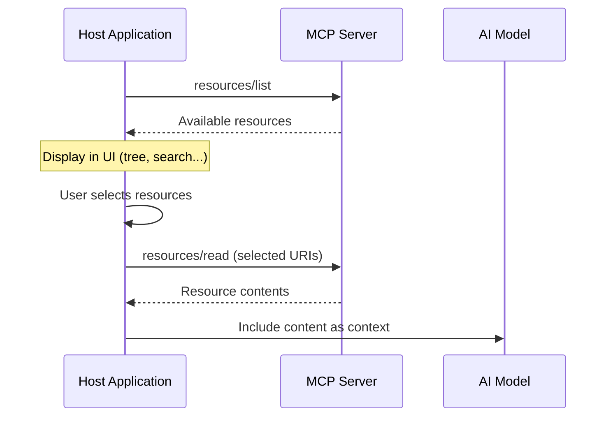

## What are Resources?

Resources are a standardized way for MCP servers to expose **read-only data** to clients. They provide contextual information that can help AI models understand your application, such as files, database schemas, configuration, or any data accessible via a URI.

::callout{icon="i-lucide-lightbulb" color="primary"}
**Key concept**: Unlike [tools](/core-concepts/tools) which are invoked directly by the AI to perform actions, resources are **application-driven**. The host application (not the AI) decides when and how to fetch and include resource content in the conversation.
::

Each resource is uniquely identified by a URI (e.g., `file:///project/README.md` or `api://users/123`).

## Resources vs Tools

Understanding the difference between resources and tools is essential:

| Aspect | Resources | Tools |
|--------|-----------|-------|
| **Purpose** | Provide context and data | Perform actions |
| **Invocation** | Application-driven (user or app selects) | AI-driven (model decides to call) |
| **Nature** | Read-only data access | Can read and modify state |
| **Control** | User/application controls what's included | AI decides when to use |
| **Examples** | Files, configs, DB schemas, logs | Send email, create file, query API |

**When to use resources:**
- Exposing project files or documentation
- Sharing database schemas or configurations
- Providing logs or system information as context

**When to use tools:**
- Performing actions that modify state
- Executing operations the AI should decide to trigger
- Interacting with external APIs or services

## How Resources are Used

Resources follow an **application-driven** model. Here's the typical flow:



1. **Discovery**: The application calls `resources/list` to discover available resources
2. **Selection**: The application displays resources in a UI (tree view, search, list) and the user or application logic selects which ones to include
3. **Reading**: The application fetches selected resources via `resources/read`
4. **Context inclusion**: The application includes the resource content in the AI conversation as context

::callout{icon="i-lucide-info" color="info"}
The AI model never directly requests resources. It's always the application that decides which resources to include based on user selection, heuristics, or automatic context detection.
::

## Static Resources

Static resources have a fixed URI that doesn't change.

### Simple File Resources

The easiest way to expose a local file is using the `file` property. This automatically handles the URI generation, MIME type detection, and file reading.

```typescript [server/mcp/resources/readme.ts]
import { defineMcpResource } from '@nuxtjs/mcp-toolkit/server' // optional

export default defineMcpResource({
  name: 'readme',
  description: 'Project README file',
  file: 'README.md', // Relative to project root
})
```

This generates:
- **URI**: `file:///path/to/project/README.md`
- **Handler**: Automatically reads the file content
- **MIME Type**: Automatically detected (e.g., `text/markdown`)

### Custom Static Resources

For more control, you can define the `uri` and `handler` manually:

```typescript [server/mcp/resources/custom-readme.ts]
import { readFile } from 'node:fs/promises'
import { fileURLToPath } from 'node:url'
import { defineMcpResource } from '@nuxtjs/mcp-toolkit/server' // optional

export default defineMcpResource({
  name: 'custom-readme',
  title: 'README',
  description: 'Project README file',
  uri: 'file:///README.md',
  metadata: {
    mimeType: 'text/markdown',
  },
  handler: async (uri: URL) => {
    const filePath = fileURLToPath(uri)
    const content = await readFile(filePath, 'utf-8')
    return {
      contents: [{
        uri: uri.toString(),
        mimeType: 'text/markdown',
        text: content,
      }],
    }
  },
})
```

## Auto-Generated Name and Title

You can omit `name` and `title` - they will be automatically generated from the filename:

```typescript [server/mcp/resources/project-readme.ts]
import { defineMcpResource } from '@nuxtjs/mcp-toolkit/server' // optional

export default defineMcpResource({
  // name and title are auto-generated from filename:
  // name: 'project-readme'
  // title: 'Project Readme'
  file: 'README.md'
})
```

The filename `project-readme.ts` automatically becomes:
- `name`: `project-readme` (kebab-case)
- `title`: `Project Readme` (title case)

You can still provide `name` or `title` explicitly to override the auto-generated values.

## Resource Structure

A resource definition consists of:

::code-group

```typescript [File Resource]
import { defineMcpResource } from '@nuxtjs/mcp-toolkit/server' // optional

export default defineMcpResource({
  name: 'resource-name',
  file: 'path/to/file.txt', // Local file path
  metadata: { ... }
})
```

```typescript [Custom Resource]
import { defineMcpResource } from '@nuxtjs/mcp-toolkit/server' // optional

export default defineMcpResource({
  name: 'resource-name',  // Unique identifier
  uri: 'uri://...',      // Static URI or ResourceTemplate
  handler: async (uri) => { // Handler function
    return { contents: [...] }
  },
})
```

::

## Dynamic Resources with Templates

Use `ResourceTemplate` to create dynamic resources that accept variables:

```typescript [server/mcp/resources/file.ts]
import { readFile } from 'node:fs/promises'
import { join } from 'node:path'
import { ResourceTemplate } from '@modelcontextprotocol/sdk/server/mcp.js'
import type { Variables } from '@modelcontextprotocol/sdk/shared/uriTemplate.js'
import { defineMcpResource } from '@nuxtjs/mcp-toolkit/server' // optional

export default defineMcpResource({
  name: 'file',
  title: 'File Resource',
  uri: new ResourceTemplate('file:///project/{+path}', {
    list: async () => {
      // Return list of available resources
      return {
        resources: [
          { uri: 'file:///project/README.md', name: 'README.md' },
          { uri: 'file:///project/src/index.ts', name: 'src/index.ts' },
        ],
      }
    },
  }),
  handler: async (uri: URL, variables: Variables) => {
    const path = variables.path as string
    const filePath = join(process.cwd(), path)
    const content = await readFile(filePath, 'utf-8')

    return {
      contents: [{
        uri: uri.toString(),
        mimeType: 'text/plain',
        text: content,
      }],
    }
  },
})
```

## ResourceTemplate

`ResourceTemplate` allows you to create resources with variable parts in the URI:

```typescript
new ResourceTemplate('file:///project/{+path}', {
  list: async () => {
    // Optional: Return list of available resources
    return {
      resources: [
        { uri: 'file:///project/file1.txt', name: 'File 1' },
        { uri: 'file:///project/file2.txt', name: 'File 2' },
      ],
    }
  },
})
```

### Template Variables

Variables in the URI are defined with `{variableName}`:

```typescript
// Single variable
new ResourceTemplate('file:///project/{path}', { ... })

// Variable allowing slashes (reserved expansion)
new ResourceTemplate('file:///project/{+path}', { ... })

// Multiple variables
new ResourceTemplate('api://users/{userId}/posts/{postId}', { ... })
```

## Handler Function

The handler receives the resolved URI and optional variables:

```typescript
// Static resource handler
handler: async (uri: URL) => {
  return {
    contents: [{
      uri: uri.toString(),
      mimeType: 'text/plain',
      text: 'Content',
    }],
  }
}

// Dynamic resource handler
handler: async (uri: URL, variables: Variables) => {
  const path = variables.path as string
  // Use variables to resolve the resource
  return {
    contents: [{
      uri: uri.toString(),
      mimeType: 'text/plain',
      text: 'Content',
    }],
  }
}
```

## Resource Metadata

Add metadata to help clients understand the resource:

```typescript [server/mcp/resources/readme.ts]
import { defineMcpResource } from '@nuxtjs/mcp-toolkit/server' // optional

export default defineMcpResource({
  name: 'readme',
  description: 'Project README file',
  file: 'README.md',
})
```

## Content Types

Resources can return different MIME types:

::code-group

```typescript [Text/Markdown]
return {
  contents: [{
    uri: uri.toString(),
    mimeType: 'text/markdown',
    text: '# Markdown content',
  }],
}
```

```typescript [JSON]
return {
  contents: [{
    uri: uri.toString(),
    mimeType: 'application/json',
    text: JSON.stringify({ key: 'value' }),
  }],
}
```

```typescript [Binary Data]
return {
  contents: [{
    uri: uri.toString(),
    mimeType: 'image/png',
    blob: Buffer.from(binaryData),
  }],
}
```

::

## Error Handling

Handle errors gracefully in your handlers:

```typescript [server/mcp/resources/custom-readme.ts]
import { readFile } from 'node:fs/promises'
import { fileURLToPath } from 'node:url'
import { defineMcpResource } from '@nuxtjs/mcp-toolkit/server' // optional

export default defineMcpResource({
  name: 'readme',
  uri: 'file:///README.md',
  handler: async (uri: URL) => {
    try {
      const filePath = fileURLToPath(uri)
      const content = await readFile(filePath, 'utf-8')

      return {
        contents: [{
          uri: uri.toString(),
          mimeType: 'text/markdown',
          text: content,
        }],
      }
    }
    catch (error) {
      return {
        contents: [{
          uri: uri.toString(),
          mimeType: 'text/plain',
          text: `Error: ${error instanceof Error ? error.message : String(error)}`,
        }],
        isError: true,
      }
    }
  },
})
```

## File Organization

Organize your resources in the `server/mcp/resources/` directory:

```
server/
└── mcp/
    └── resources/
        ├── readme.ts
        └── file.ts
```

Each file should export a default resource definition.

## URI Schemes

You can use any URI scheme that makes sense for your use case:

- `file://` - File system resources
- `api://` - API endpoints
- `http://` / `https://` - Web resources
- `custom://` - Custom schemes

## Next Steps

- [Tools](/core-concepts/tools) - Create tools to perform actions
- [Prompts](/core-concepts/prompts) - Create reusable prompts
- [Handlers](/core-concepts/handlers) - Create custom MCP endpoints
- [Examples](/examples/file-operations) - More resource examples
