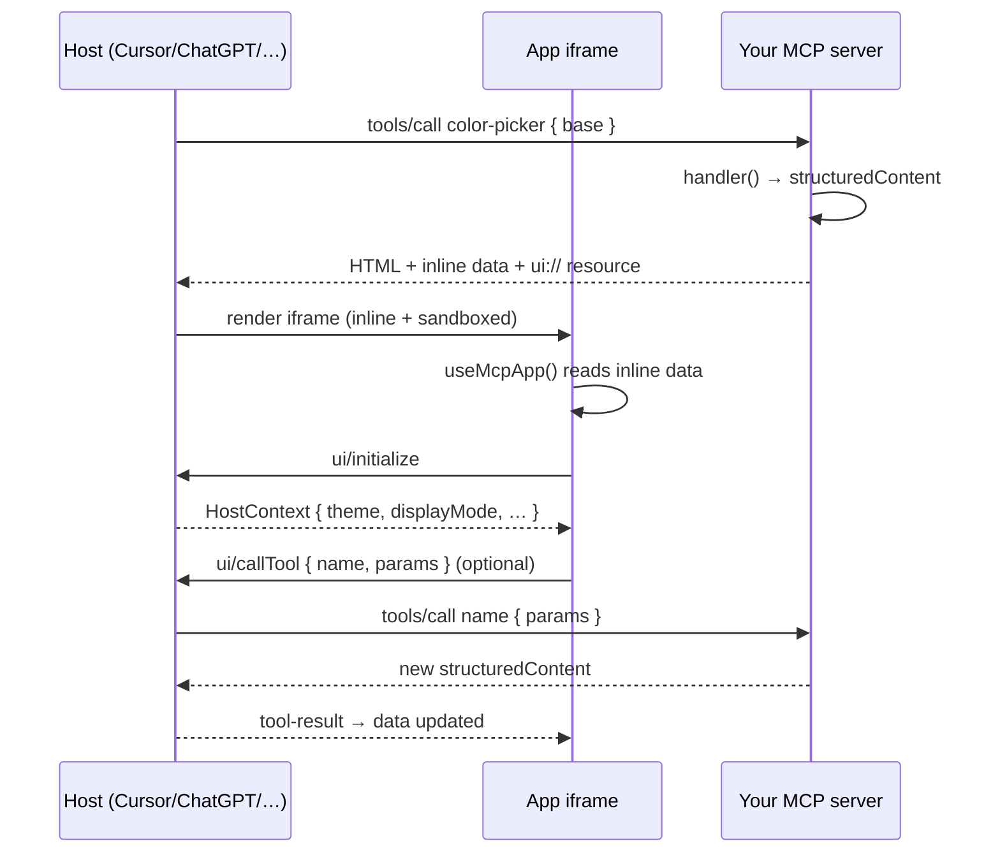

This page covers the moving parts behind [MCP Apps](/core-concepts/apps): the build pipeline, the host bridge, the security model, and patterns you can compose on top.

## Build Pipeline

For each `app/mcp/*.vue` file, the Nuxt module emits **three artifacts** at build time and registers them on the configured handler:

```bash
.nuxt/mcp-apps/
├── color-picker.app.ts       # McpAppDefinition (the parsed defineMcpApp call)
├── color-picker.tool.ts      # McpToolDefinition wrapping the app
├── color-picker.resource.ts  # McpResourceDefinition serving the HTML
└── color-picker.html         # Single-file Vue bundle (vite-plugin-singlefile)
```

The pipeline runs in three phases:

1. **Parse** — extract the `defineMcpApp({ … })` call from `<script setup>` and pull out only the imports that are referenced inside the macro arguments. The macro is then **stripped** from the browser bundle.
2. **Bundle** — call Vite programmatically with [`vite-plugin-singlefile`](https://github.com/richardtallent/vite-plugin-singlefile) to produce one self-contained HTML file (Vue runtime, your code, scoped CSS, assets) per SFC.
3. **Emit** — write the three TypeScript files plus the HTML, then add them to Nuxt's auto-import + handler registration so they behave like any other tool / resource.

::callout{icon="i-lucide-info" color="info"}
Output lives under `<buildDir>/mcp-apps/`. It's regenerated on every build, and the dev server watches `app/mcp/**` so changes hot-reload.
::

### What Gets Inlined Into The HTML

When the LLM calls the tool, the toolkit takes the bundled HTML and injects:

```html
<meta http-equiv="Content-Security-Policy" content="…">
<script type="application/json" id="mcp-app-data">
  { "destination": "Lisbon", "stays": [ … ] }
</script>
```

The first `useMcpApp()` call reads `#mcp-app-data` synchronously, so `data.value` is **already populated on the first paint** — no fetch, no waterfall.

## The Host Bridge

The iframe and the host communicate over `postMessage` using a JSON-RPC 2.0 envelope. The toolkit ships a singleton `useHostBridge()` (internal) that:

1. Performs the `ui/initialize` handshake to negotiate capabilities and receive `HostContext`.
2. Routes incoming `tool-result` messages back into `data`.
3. Dispatches outbound `callTool`, `prompt`, `openLink` requests to the host.
4. Falls back to the legacy `mcp-ui` envelope (`{ type, payload }`) when talking to older hosts.
5. Detects the **ChatGPT Apps SDK** (`window.openai`) and uses its native APIs when available.

You don't talk to it directly — `useMcpApp()` composes the public surface.



## Security Model

MCP Apps run in a sandboxed iframe loaded from the same origin as your MCP endpoint. The toolkit hardens the surface in three layers.

### 1. Default CSP

Every app HTML gets a CSP `<meta>` that:

- Blocks all third-party scripts. Only the inline bundle script may execute.
- Blocks `<form>` action targets.
- Allows `frame-ancestors *` so any host can embed the iframe (the host enforces its own ancestor policy).
- Disallows `connect-src`, `img-src`, `style-src`, `font-src` external origins until you explicitly allow them.

You opt into external resources per app:

```ts
defineMcpApp({
  csp: {
    resourceDomains: ['https://images.example.com'], // img / style / font / link
    connectDomains: ['https://api.example.com'],     // fetch / XHR / WebSocket
  },
  // …
})
```

The same allow-list is mirrored into `_meta.ui.csp` and `_meta['openai/widgetCSP']` for hosts that enforce CSP themselves.

### 2. Domain Validation

CSP origins are validated at build time. The toolkit rejects:

- Non-string or empty values.
- Anything that isn't an `http(s)://` or `ws(s)://` URL.
- Strings that contain quotes, semicolons, parentheses, whitespace, or path / query / fragment characters.

If a domain looks suspicious, the build fails — you can't accidentally ship an injection vector via misconfiguration.

### 3. Iframe Isolation

The iframe runs as if it were a third-party page on your origin: no cookies, no `localStorage` from the parent app, no shared module graph. This is **by design** — apps must declare what they need, and they cannot reach into the parent Nuxt runtime.

::callout{icon="i-lucide-shield" color="warning"}
Pass `csp: false` only when you fully control every byte the iframe loads. Stripping the CSP turns off the only line of defense against compromised dependencies.
::

## Custom `_meta`

The handler returns a regular MCP `CallToolResult`, so you can attach any host-specific metadata via `_meta`:

```ts
defineMcpApp({
  _meta: {
    'openai/widgetAccessible': true,
    'openai/toolInvocation/invoking': 'Loading stays…',
    'openai/toolInvocation/invoked': 'Stays loaded',
  },
  handler: async () => ({ structuredContent: { … } }),
})
```

The toolkit auto-fills `_meta.ui.resourceUri` (so hosts can re-fetch the HTML on demand) and `_meta.ui.csp`. Anything you put in `_meta` is merged on top.

## Advanced Patterns

### Re-using server logic

Apps share `server/api/`, `server/utils/`, and `#shared/types/` with the rest of your Nuxt app. A typical layout:

```bash
app/mcp/stay-finder.vue           # UI + handler that calls $fetch('/api/stays')
server/api/stays.get.ts           # The actual data endpoint (callable by humans + tools)
server/utils/stays.ts             # Shared generators / helpers
shared/types/stays.ts             # Types reachable from both the SFC and the endpoint
```

This means a regular Nuxt page or an external client can hit `/api/stays` with the exact same contract as the MCP App handler.

### Pre-warming with `cache`

The handler is a regular MCP tool callback, so it inherits the toolkit's caching:

```ts
defineMcpApp({
  description: 'Find boutique stays.',
  cache: '5m',
  handler: async (query) => ({ structuredContent: await $fetch('/api/stays', { query }) }),
})
```

Identical inputs return cached `structuredContent` (and therefore cached HTML) for 5 minutes. See [Caching](/core-concepts/tools#response-caching).

### Multiple handlers

Isolate apps from your other tools by giving them their own MCP endpoint:

```ts [server/mcp/apps.ts]
import { defineMcpHandler } from '@nuxtjs/mcp-toolkit/server'

export default defineMcpHandler({
  route: '/mcp/apps',
  appsDir: 'app/mcp',
  // your tools / resources / prompts can live elsewhere — this handler exposes only apps
})
```

Connect the host to `https://your-app/mcp/apps` to expose **only** the apps surface, separate from your back-office tools. See [Handlers](/core-concepts/handlers).

### Per-host adaptation

Use `hostContext` to opt into host-specific affordances:

```ts
const isChatGpt = computed(() => typeof window !== 'undefined' && 'openai' in window)
const supportsFullscreen = computed(() => hostContext.value?.displayMode !== undefined)
```

Avoid hard-coding behaviours per host whenever you can — the bridge already smooths over the major differences.

### Testing apps

Server-side: the `handler` is a plain async function. Import the parsed app definition from `.nuxt/mcp-apps/<name>.app.ts` (or import the SFC's `defineMcpApp` arguments via the parser) and call the handler directly with mock input.

Iframe-side: render the SFC with `@vue/test-utils` and stub the host bridge by injecting `window.parent.postMessage` listeners. The toolkit's own test suite (`packages/nuxt-mcp-toolkit/test/apps-handshake.test.ts`) shows the pattern.

::callout{icon="i-lucide-info" color="info"}
Most regressions in MCP Apps come from forgetting that **`handler` runs server-side and the template runs client-side**. Treat them as two halves of an API: one produces a contract (`structuredContent`), the other consumes it.
::

## Limits & Footguns

- **One handler per app.** If you need a second tool from the same UI, declare it elsewhere and call it via `callTool('other-tool', …)`.
- **No top-level await in `<script setup>`** of an app — the macro must be statically analysable.
- **Only relative imports + auto-imports + the `#shared` alias** in the SFC. Anything that pulls in the Nuxt runtime won't bundle.
- **Keep payloads small.** The data is inlined into the HTML; large payloads (>1 MB) noticeably slow first paint.
- **Style with `scoped`.** Global styles leak across apps because every app loads its own copy of Vue's style runtime.
